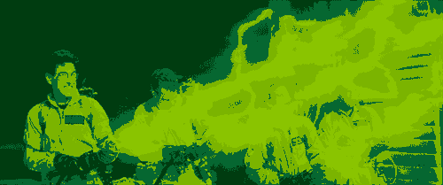

revisit-ncolorpalette-service
=============================

Applies a Gameboy effect to an image, and accepts / outputs according to the [revisit.link spec](http://revisit.link/spec.html).

Routes
------

`/gameboy/service`
------------------

![Ghostbusters][ghostbusters]

becomes

`/cycled-gameboy/service`
------------------

![Ghostbusters][ghostbusters]

becomes

[Ghostbusters]: fixtures/ghostbusters.gif

License
-------

MIT

